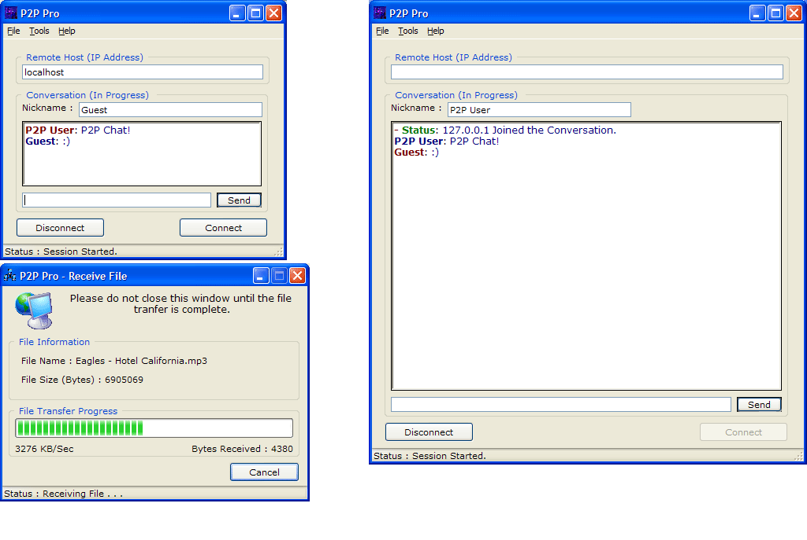



## \_P2P Pro\_ \(Chat & Send Files\)

### Description

This was a freeware program that I had on my website; but eventually removed it. It allows two users to chat and send files (of any size). This is a stand-alone application, meaning there are not two programs (client and server). The client and server are both built in to the same application. The screenshot shows the main chat window, and the "receiving file" window. It says the file transfer is going over 3 MB/sec, that is because I was sending it locally (to myself). Over a cable connection, the files usually send about 50-60 KB/s.

The help section and "bug reporting" do not work because I no longer have that content on my website; but everything else should work. I spent some time on this, so please take a few seconds to leave a comment. :)
 
### More Info
 

             |
---                |---
**Submitted On**   |2003-07-03 00:19:38
**By**             |[Daniel W\. Elkins](https://github.com/Planet-Source-Code/PSCIndex/blob/master/ByAuthor/daniel-w-elkins.md)
**Level**          |Advanced
**User Rating**    |4.9 (192 globes from 39 users)
**Compatibility**  |VB 3\.0, VB 4\.0 \(16\-bit\), VB 4\.0 \(32\-bit\), VB 5\.0, VB 6\.0
**Category**       |[Complete Applications](https://github.com/Planet-Source-Code/PSCIndex/blob/master/ByCategory/complete-applications__1-27.md)
**World**          |[Visual Basic](https://github.com/Planet-Source-Code/PSCIndex/blob/master/ByWorld/visual-basic.md)
**Archive File**   |[\_P2P\_Pro\_\_160946742003\.zip](https://github.com/Planet-Source-Code/daniel-w-elkins-p2p-pro-chat-send-files__1-46633/archive/master.zip)

